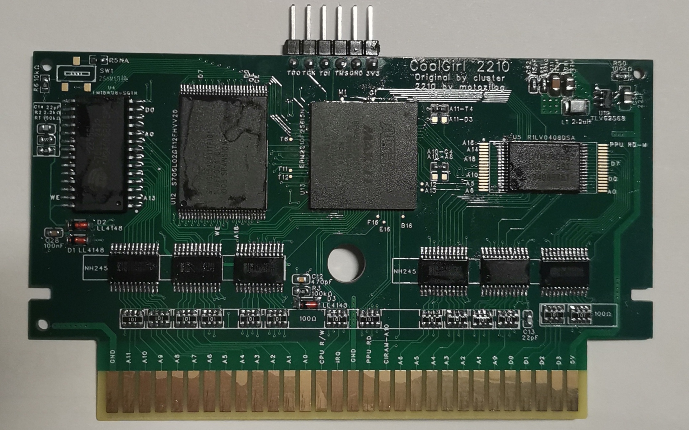
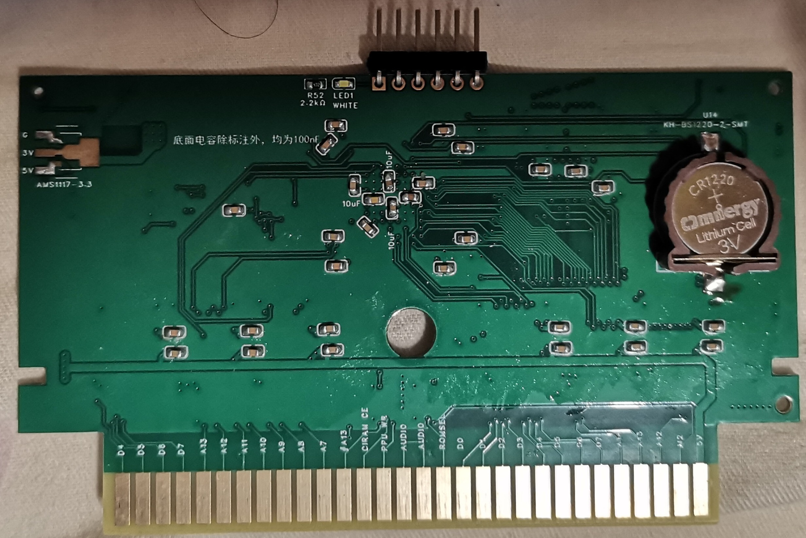
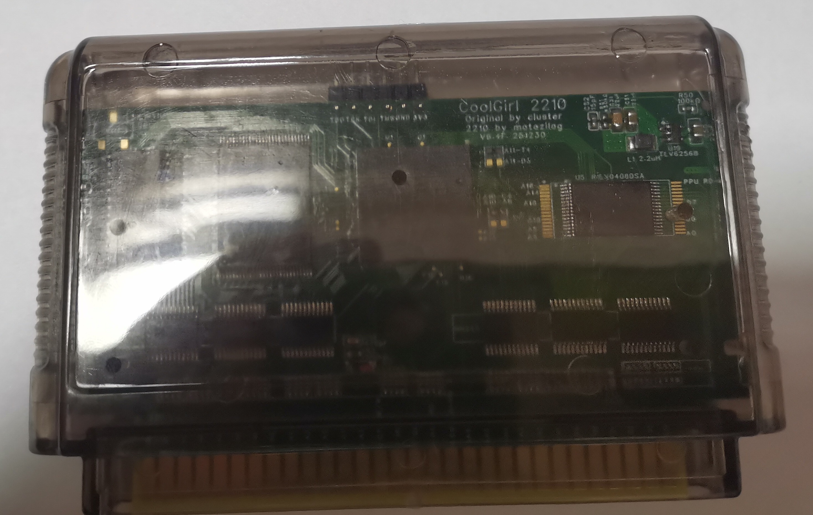
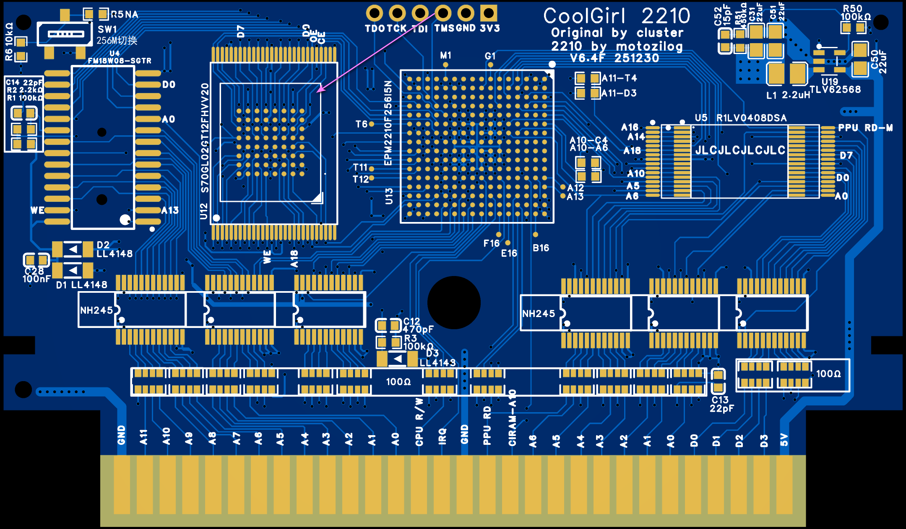

# CoolGirl2210
EPM2210 Variant of the COOLGIRL - Ultimate Multigame Cartridge for the Famicom

Supports ALL COOLGIRL mappers in a single cartridge.

Original COOLGIRL Design:

* [COOLGIRL - ultimate multigame cartridge for Famicom](https://github.com/ClusterM/coolgirl-famicom-multicart) by Alexey Cluster

## Upgrades:

1. EPM1270 → EPM2210: The upgraded CPLD allows support for ALL COOLGIRL mappers.

2. 3.3V Power: Switched from an LDO to a DC-DC converter. This allows the cartridge to run on cheaper Famicom clones (e.g., the Subor D99, which uses USB power and only supplies 500mA!).

3. SRAM: Replaced the very expensive FM18L08 chip with the cheaper LY62256.

4. CHR-RAM: Relocated the STSOP-32 footprint to allow easier CHR-RAM troubleshooting.

5. Flash Expansion: Reserved footprint for the S70GL02GT for future upgrades (utilizing `hardware` bank switching to switch between the upper 1G and lower 1G).

6. Resistors: Changed from 0402x4 chip resistor arrays to 0603x4 for easier DIY assembly.

7. Level Shifters: Changed from a single SN74ALVC164245 to two SN74LVC8T245 for easier DIY assembly.

8. Assembly: All optional components are placed on the bottom layer, allowing for SMT assembly on the top layer only.

Due to a factory defect in some EPM2210 chips, EPM2210 may have no output on the D4 and C4 pins.
**It is strongly recommended to run EPM2210TEST to verify ALL pins after soldering the EPM2210.**
(Use φ2(M2) as the clock input, located at the D3-LL4148 positive pin.)

## Recommended Soldering Order
Prepare a Famicom Writer, STM32 or ATmega based is also acceptable

> **Soldering Guide (in Chinese) for the Original CoolGirl**
>
> https://www.bilibili.com/opus/993115658548936710
>
> *Note: This tutorial is for the original version. CoolGirl2210 requires BGA soldering skills.*

CoolGirl2210 Soldering Order:

1. 3.3V Power Circuit (U19, C50, L1, R50, R51, C52, C51): Solder these components first, then verify that the 3.3V output is correct.

2. EPM2210 (U13): Solder the CPLD.

3. Initial CPLD Test: Program the EPM2210TEST file into the EPM2210. Temporarily connect a wire from the Clock source to the diode of D3 (LL4148) . Use an oscilloscope to probe all relevant pins to verify the test configuration.

4. CPLD Programming: Program the main firmware (CoolGirl_rev6.x/output_files) into the EPM2210.

5. Reset Circuit, SRAM, and SRAM Level Shifters: Solder these components and verify them using the CoolGirl Test script.

6. CHR-RAM and CHR-RAM Level Shifters: Solder and verify using the CoolGirl Test script.

7. Flash Memory: Solder and program using the famicom-dumper-client with the write-coolgirl command.

## PCB order info:
LCEDA/EasyEDA design file,schematic,Gerbers,BOM are /coolgirl-2210-UseCoolGirl_rev6.x/CoolGirl_rev6.x/hardware

* Layers: 4
* PCB Thickness: 1.2mm
* Specify Stackup: JLC04121H-3313
* Impedance Control: No requirement
* Gold fingers: Yes
* Beveling: 30°
* Surface Finish: ENIG(Expensive but recommended)

S70GL02 localtion(Expensive, not verify)

